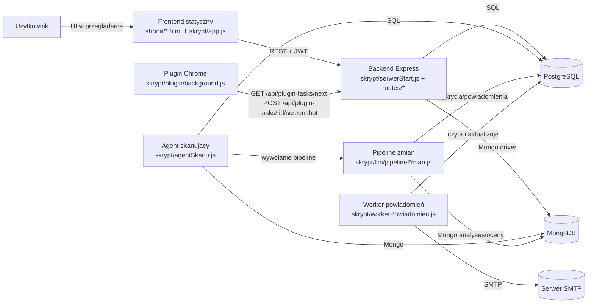
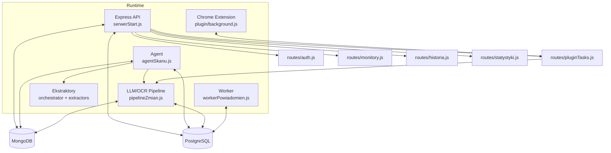
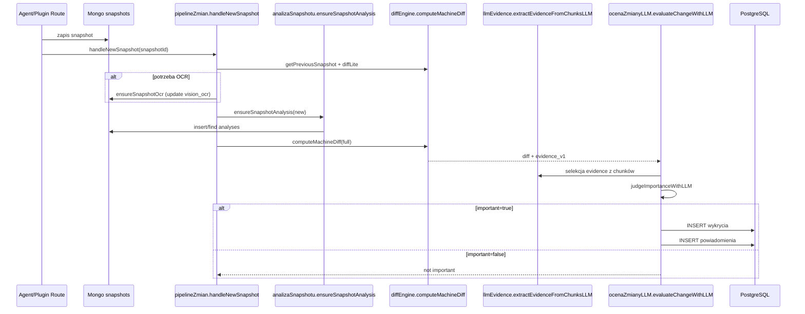
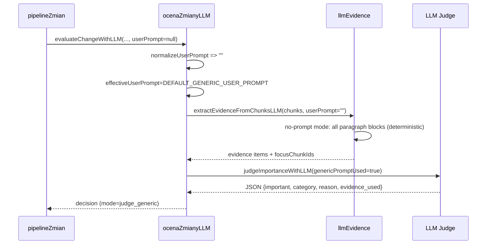
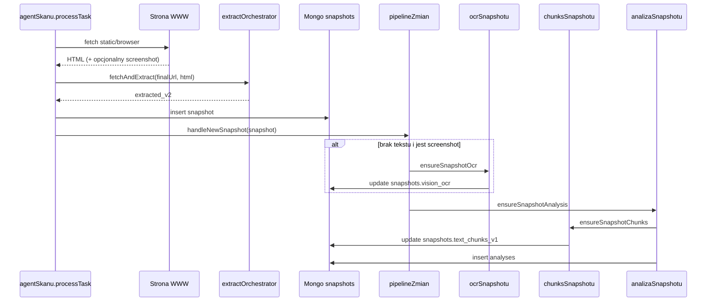
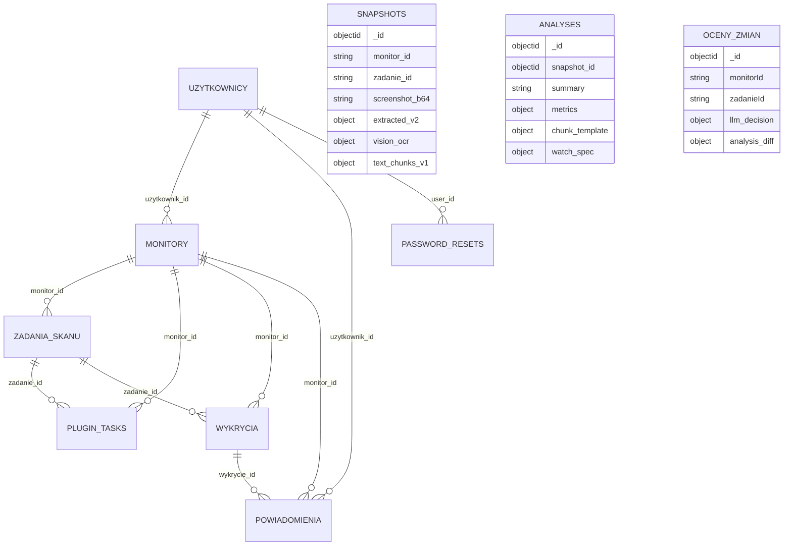
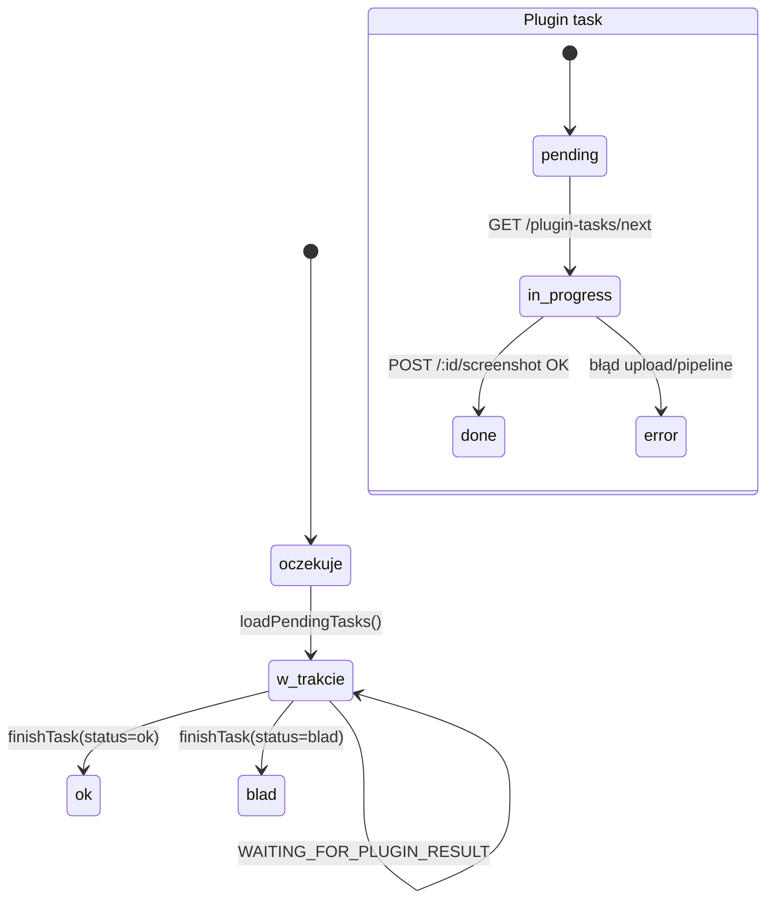
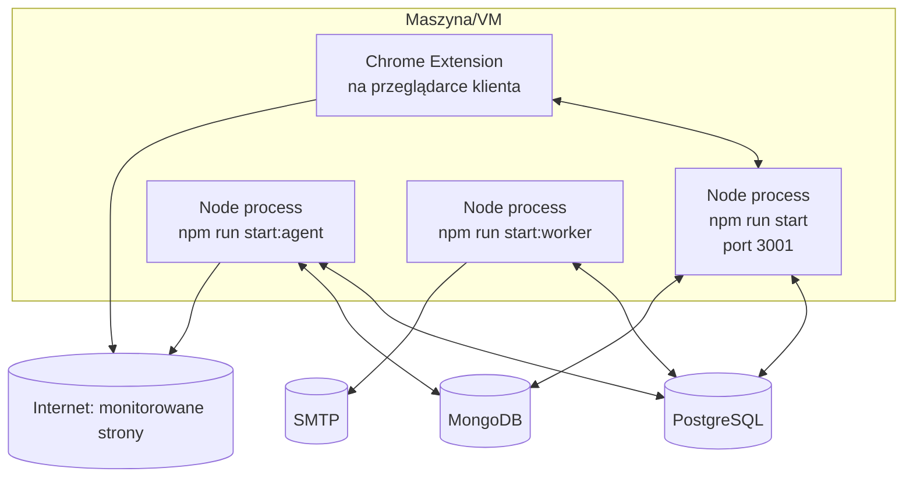

# Diagramy architektury (Mermaid)

Ten plik zawiera komplet najważniejszych diagramów na podstawie aktualnego kodu repo.

## Spis diagramów

1. [System Context](#1-system-context)
2. [Kontenery/komponenty](#2-kontenery-i-komponenty)
3. [Przepływ danych pipeline](#3-przepływ-danych-pipeline)
4. [Sekwencja A: snapshot + evidence + judge](#4-sekwencja-a-snapshot-analysis--evidence--judge)
5. [Sekwencja B: brak userPrompt → paragrafy evidence + generic judge](#5-sekwencja-b-brak-userprompt--paragrafy-evidence--generic-judge)
6. [Sekwencja C: monitor task → open page → OCR → chunks → DB](#6-sekwencja-c-monitor-task--open-page--ocr--chunks--db)
7. [ERD / model danych](#7-erd--model-danych)
8. [State machine zadania/monitoringu](#8-state-machine-zadaniamonitoringu)
9. [Deployment runtime](#9-deployment-runtime)
10. [Luki informacyjne / placeholdery](#10-luki-informacyjne--placeholdery)

---

## 1. System Context



---

## 2. Kontenery i komponenty



---

## 3. Przepływ danych pipeline

```mermaid
flowchart LR
    S1[Snapshot nowy\nMongo snapshots] --> P0[handleNewSnapshot]
    S0[Snapshot poprzedni\ngetPreviousSnapshot] --> P0

    P0 --> D1[computeMachineDiff lite]
    D1 --> E1{Early exit?}
    E1 -- tak --> END1[Stop: no_change/negligible]
    E1 -- nie --> O1[ensureSnapshotOcr\n(gdy potrzebne)]

    O1 --> A1[ensureSnapshotAnalysis\n(new analysis)]
    A1 --> A0[getSnapshotAnalysis\n(prev analysis)]
    A0 --> D2[computeMachineDiff full\n+ universal_data]
    D2 --> EV[evidence_v1 / evidence pool]
    EV --> J[evaluateChangeWithLLM\njudge / judge_generic]
    J --> IMP{important?}
    IMP -- nie --> END2[Stop: not_important]
    IMP -- tak --> SAVE[saveDetectionAndNotification]
    SAVE --> PG[(PG: wykrycia + powiadomienia)]
```

---

## 4. Sekwencja A: snapshot analysis + evidence + judge



---

## 5. Sekwencja B: brak userPrompt → paragrafy evidence + generic judge



---

## 6. Sekwencja C: monitor task -> open page -> OCR -> chunks -> DB



---

## 7. ERD / model danych



---

## 8. State machine zadania/monitoringu



---

## 9. Deployment runtime



---

## 10. Luki informacyjne / placeholdery

1. **DDL SQL** – brak migracji w repo, więc ERD jest odtworzony z query runtime (do potwierdzenia przez autora bazy).
2. **Docelowy deployment produkcyjny** (Docker/K8s/systemd) – brak plików IaC w repo.
3. **Topologia sieci i security hardening** – brak jawnej konfiguracji reverse proxy/TLS w repo.
